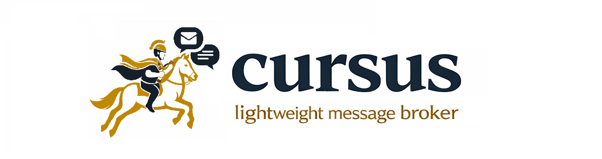

 

 

Cursus is a **lightweight message broker** inspired by design philosophy of
_logically separated but physically distributed data management_.

It aims to provide a minimal, efficient, and extensible messaging backbone for small-scale environments.

## 🚀 Key Features
**📨 Topic-based Messaging**
- Parallel processing by partition unit
- Synchronous, asynchronous, and batch-based message publishing with idempotent producers
- Pull/Stream model consumption, consumer groups with automatic rebalancing

**💾 Persistence**
- Asynchronous disk writes with batching
- Segment rotation, efficient reads through mmap

**🛠 Flexibility**
- Platform-specific optimizations (Linux: sendfile, fadvise)
- Stand-alone and Distributed Cluster (Raft) mode

## 📖 Documentation

To learn more about [documentation](docs/README.md).

## 🤝 Community

This project is currently maintained by a single developer.
We truly welcome early contributors and feedback during this development phase.

As the project grows and becomes more mature, we plan to establish more structured community such as a Slack and regular contributor meetings.

For now, you can:
- Ask questions or share feedback via GitHub Issues
- Reach out directly through email or GitHub
